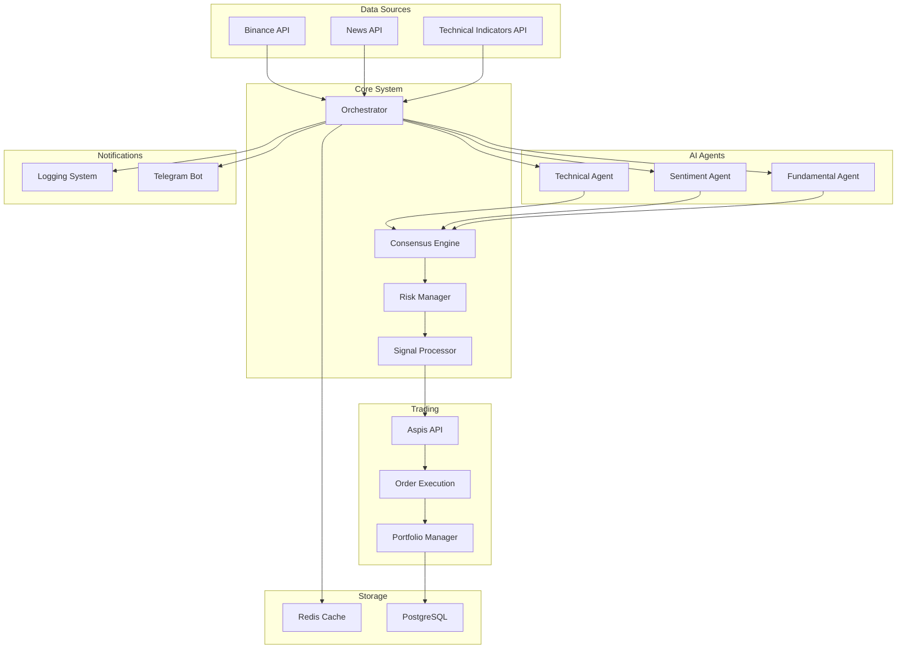
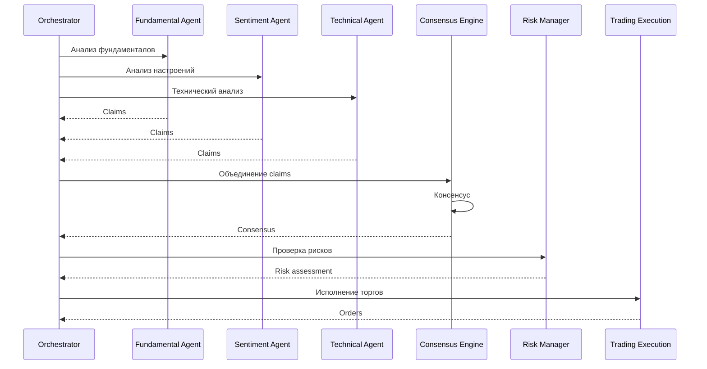

# Архитектура системы

## 🏗️ Обзор архитектуры

Hedge Fund AI Trading System построена на принципах микросервисной архитектуры с использованием многоагентного подхода для принятия торговых решений.

### 🎯 Основные компоненты

## 🤖 AI Агенты

### 📊 Fundamental Agent
Анализирует фундаментальные показатели:
- Объем торгов
- Ликвидность
- Волатильность
- Рыночная капитализация

### 📰 Sentiment Agent
Обрабатывает новости и настроения:
- Анализ новостей
- Социальные медиа
- Рыночная психология

### 📈 Technical Agent
Технический анализ:
- RSI, MACD, Bollinger Bands
- Паттерны графиков
- Ценовое действие

## 🔄 Процесс принятия решений

## 💾 Хранение данных

### PostgreSQL
- **claims** - утверждения агентов
- **consensus** - консенсусные решения
- **evidence** - доказательства
- **news** - новости
- **orders** - ордера
- **positions** - позиции
- **rounds** - торговые раунды
- **risk_violations** - нарушения рисков

### Redis
- Кэширование API ответов
- Временные данные
- Сессии

## 🔌 API Интеграции

### Binance API
- Рыночные данные
- Цены в реальном времени
- Объемы торгов

### Aspis API v2
- Исполнение ордеров
- Управление портфелем
- Позиции

### News API
- Новости криптовалют
- Анализ настроений
- Источники новостей

### Technical Indicators API
- Технические индикаторы
- Метаданные активов
- Сигналы

## 📱 Уведомления

### Telegram Bot
- Анализ агентов
- Консенсусные решения
- Исполнение ордеров
- Управление рисками

### Логирование
- Структурированные логи
- Отслеживание ошибок
- Метрики производительности

## 🚀 Масштабируемость

### Горизонтальное масштабирование
- Независимые агенты
- Микросервисная архитектура
- Кэширование

### Вертикальное масштабирование
- Оптимизация запросов
- Индексы БД
- Асинхронная обработка

## 🔒 Безопасность

### API Безопасность
- Аутентификация
- Авторизация
- Rate limiting

### Данные
- Шифрование в покое
- Шифрование в движении
- Резервное копирование

### Торговля
- Управление рисками
- Лимиты позиций
- Kill switch
