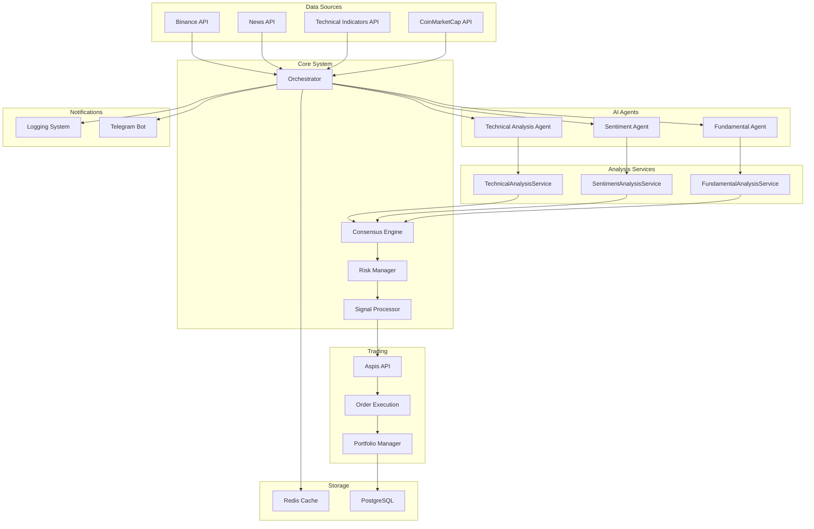
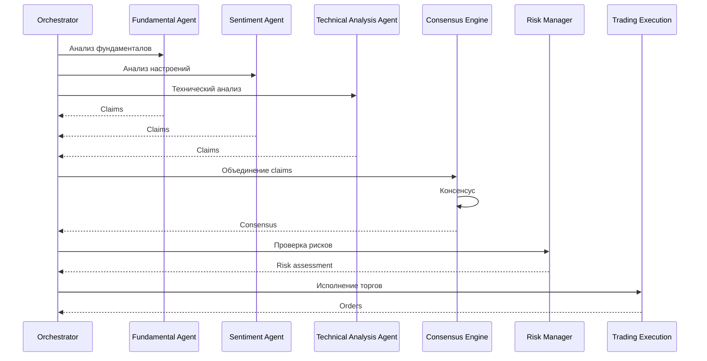

# Архитектура системы

## 🏗️ Обзор архитектуры

Hedge Fund AI Trading System построена на принципах микросервисной архитектуры с использованием многоагентного подхода для принятия торговых решений.

### 🎯 Основные компоненты



## 🤖 AI Агенты

### 📊 Fundamental Agent
Анализирует фундаментальные показатели:
- **On-chain метрики**: Network activity, transaction volume, addresses
- **Social sentiment**: GalaxyScore, social volume, community engagement
- **Market cap**: Circulating supply, market dominance, institutional data
- **Liquidity**: Volume analysis, bid-ask spreads, trading activity
- **Risk factors**: Volatility, correlation, drawdown analysis

**API Endpoints:**
- `/indicators` endpoint (Signals API) - фундаментальные данные
- Binance API - рыночные данные
- CoinMarketCap API - market cap и supply данные

**Сервис:** `FundamentalAnalysisService`

### 📰 Sentiment Agent
Обрабатывает новости и настроения:
- **News sentiment**: Анализ новостей, freshness, consistency, credibility
- **Social metrics**: GalaxyScore, social volume, tweets, interactions
- **Fear & Greed Index**: Рыночные настроения от CoinMarketCap
- **Market mood**: Комплексный анализ эмоциональных факторов

**API Endpoints:**
- NewsAPI - новости
- `/indicators` endpoint (Signals API) - social metrics
- CoinMarketCap API - Fear & Greed Index

**Сервис:** `SentimentAnalysisService`

### 📈 Technical Analysis Agent (бывший ValuationAgent)
Технический анализ:
- **Technical indicators**: RSI, MACD, ADX, Stochastic, Bollinger Bands
- **Moving averages**: SMA/EMA (10,20,30,50,100,200 periods)
- **Support & Resistance**: Pivot Points, price levels
- **Signal strength**: Комбинированный анализ технических сигналов
- **Volatility**: ADX-based volatility estimation

**API Endpoints:**
- `/stats` endpoint (Signals API) - технические индикаторы
- `/indicators` endpoint - цена и объем (для getAssetMetadata)

**Сервис:** `TechnicalAnalysisService`

## 🔧 Сервисы анализа

### **FundamentalAnalysisService** - Математические расчеты фундаментальных метрик
```typescript
// PURE SERVICE - только расчеты
- calculateOnChainHealth() // Network activity, transaction efficiency
- calculateSocialSentiment() // Social volume, engagement, community health
- calculateRiskAdjustment() // Volatility, correlation, drawdown risk
- calculateCorrelationFactor() // Diversification benefit
- calculateLiquidityScore() // Volume, spread, price change
- calculateVolumeMomentum() // Volume change momentum
- calculateMarketCapHealth() // Market cap efficiency and supply utilization
- createFundamentalAnalysis() // Comprehensive fundamental score
```

### **SentimentAnalysisService** - Математические расчеты настроений
```typescript
// PURE SERVICE - только расчеты
- calculateNewsSentiment() // News sentiment, freshness, consistency, credibility
- calculateSocialSentiment() // Social volume, GalaxyScore, interactions
- calculateFearGreedInterpretation() // Fear & Greed Index analysis
- calculateMarketSentiment() // Market sentiment from CMC data
- createComprehensiveSentimentAnalysis() // Final sentiment score
- getSentimentSummary() // LLM-friendly summary
```

### **TechnicalAnalysisService** - Математические расчеты технических индикаторов
```typescript
// PURE SERVICE - только расчеты
- calculateSignalStrength() // RSI, MACD, ADX, Stochastic
- calculateTrendStrength() // Moving Averages
- calculateVolatilityEstimate() // ADX-based volatility
- getTechnicalSummary() // LLM-friendly summary
```

## 🎭 Разница между Agent и Service

### **Agent** (например, SentimentAgent)
```typescript
// Использует LLM для анализа
- processData() // Получает данные
- buildSystemPrompt() // Промпт для LLM
- buildUserPrompt() // Данные для LLM
- run() // Генерирует claims через LLM
```

### **Service** (например, SentimentAnalysisService)
```typescript
// Только математические расчеты
- calculateNewsSentiment() // Расчет метрик новостей
- calculateSocialSentiment() // Расчет social метрик
- createComprehensiveSentimentAnalysis() // Итоговая формула
- НЕ использует LLM, НЕ генерирует claims
```

## 🔄 Процесс принятия решений



## 📊 API Endpoint Mapping

### **Technical Analysis Agent** → `/stats` endpoint
```typescript
// Технические индикаторы
{
  RSI: number,
  "MACD.macd": number,
  ADX: number,
  "Stoch.K": number,
  SMA20: number,
  EMA50: number,
  "BBPower": number,
  "W.R": number,
  "CCI20": number
}
```

### **Fundamental Agent** → `/indicators` endpoint
```typescript
// Фундаментальные данные
{
  lp: number, // price
  volume: number,
  market_cap: number,
  hash_rate: number,
  social_volume_24h: number,
  addresses_active: number,
  galaxyscore: number,
  // ... 50+ дополнительных полей
}
```

### **Sentiment Agent** → `/indicators` endpoint + внешние API
```typescript
// Social metrics + News + Fear & Greed
{
  social_volume_24h: number,
  tweets: number,
  interactions: number,
  galaxyscore: number
}
```

## 📈 Enhanced Scoring Formulas

### **Technical Score** (Technical Analysis Agent)
```typescript
// Based on technical indicators only
technical_score = signal_strength × trend_strength × volatility_factor
```

### **Fundamental Score** (Fundamental Agent)
```typescript
// Enhanced formula with on-chain and social data
fundamental_score = liquidity_score × volume_momentum × trend_strength × 
                   market_cap_health × on_chain_health × social_sentiment × 
                   risk_adjustment × correlation_factor
```

### **Sentiment Score** (Sentiment Agent)
```typescript
// Comprehensive sentiment analysis
sentiment_score = (news_score × 0.7) + (social_score × 0.3)
where:
news_score = sentiment × coverage_norm × freshness × consistency × credibility × market_mood_factor
social_score = (galaxyscore/100 × 0.4) + (social_volume_norm × 0.3) + (interactions_norm × 0.3)
```

### **Final Consensus Score**
```typescript
// Weighted combination of all agents
final_score = (fundamental_score × 0.30) +
              (sentiment_score × 0.30) + 
              (technical_score × 0.40)
```

## 💾 Хранение данных

### PostgreSQL
- **claims** - утверждения агентов
- **consensus** - консенсусные решения
- **evidence** - доказательства
- **news** - новости
- **orders** - ордера
- **positions** - позиции
- **rounds** - торговые раунды
- **risk_violations** - нарушения рисков

### Redis
- Кэширование API ответов
- Временные данные
- Сессии

## 🔌 API Интеграции

### Binance API
- Рыночные данные
- Цены в реальном времени
- Объемы торгов

### Aspis API v2
- Исполнение ордеров
- Управление портфелем
- Позиции

### News API
- Новости криптовалют
- Анализ настроений
- Источники новостей

### Technical Indicators API
- **`/stats` endpoint**: Технические индикаторы (RSI, MACD, ADX, etc.)
- **`/indicators` endpoint**: Фундаментальные данные (on-chain, social, market cap)

### CoinMarketCap API
- Market cap и supply данные
- Fear & Greed Index
- Институциональные метрики

## 📱 Уведомления

### Telegram Bot
- Анализ агентов
- Консенсусные решения
- Исполнение ордеров
- Управление рисками

### Логирование
- Структурированные логи
- Отслеживание ошибок
- Метрики производительности

## ✅ Преимущества архитектуры

### **1. Четкое разделение ответственности**
- **Technical Analysis Agent**: Только технические индикаторы
- **Fundamental Agent**: Только фундаментальные метрики
- **Sentiment Agent**: Только новости, настроения и social метрики

### **2. Переиспользование сервисов**
- Математические расчеты вынесены в отдельные сервисы
- Сервисы можно тестировать независимо от LLM
- Легко добавлять новые агенты или сервисы

### **3. Расширенные данные**
- **Technical**: 45+ технических индикаторов из `/stats`
- **Fundamental**: 50+ метрик из `/indicators`
- **Social**: News + Fear & Greed Index + social metrics

### **4. Улучшенная точность**
- **Специализированные сервисы**: Каждый сервис оптимизирован для своего домена
- **Богатые источники данных**: Множественные API endpoints с комплексными данными
- **Продвинутые формулы**: Софистицированные формулы для каждого типа анализа

### **5. Лучшая поддерживаемость**
- **Модульная архитектура**: Сервисы могут обновляться независимо
- **Type Safety**: Комплексные TypeScript интерфейсы
- **Четкие интерфейсы**: Хорошо определенные границы сервисов

## 🚀 Масштабируемость

### Горизонтальное масштабирование
- Независимые агенты
- Микросервисная архитектура
- Кэширование

### Вертикальное масштабирование
- Оптимизация запросов
- Индексы БД
- Асинхронная обработка

## 🔒 Безопасность

### API Безопасность
- Аутентификация
- Авторизация
- Rate limiting

### Данные
- Шифрование в покое
- Шифрование в движении
- Резервное копирование

### Торговля
- Управление рисками
- Лимиты позиций
- Kill switch

## 🎯 Ключевые принципы

- **Technical Analysis Agent**: Только технические индикаторы
- **Fundamental Agent**: Только фундаментальные метрики
- **Sentiment Agent**: Только новости, настроения и social метрики
- **Сервисы**: Только математические расчеты
- **LLM**: Только для генерации claims и объяснений

## 📊 Performance Considerations

### **API Rate Limits**
- **Technical Indicators API**: 60 requests/minute
- **CoinMarketCap API**: 30 requests/day (free tier)
- **News API**: Varies by plan

### **Caching Strategy**
- **Technical Data**: Cache for 5-15 minutes
- **Fundamental Data**: Cache for 1-5 minutes
- **Social Data**: Cache for 1-2 minutes

### **Error Handling**
- **Graceful Degradation**: Каждый агент может работать с частичными данными
- **Fallback Mechanisms**: Использование кэшированных данных при сбоях API
- **Confidence Scoring**: Снижение уверенности при неполных данных

Эта архитектура обеспечивает прочную основу для масштабируемого, поддерживаемого и точного анализа криптовалют с четким разделением ответственности и расширенным использованием данных.
