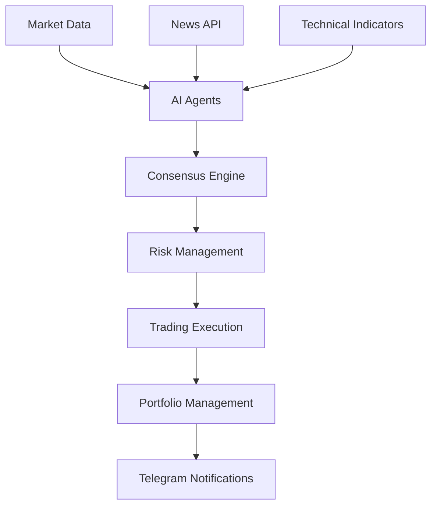

# Hedge Fund AI Trading System

> Интеллектуальная система торговли криптовалютами на основе многоагентного консенсуса

## 🚀 Обзор системы

Hedge Fund AI Trading System - это продвинутая система автоматической торговли криптовалютами, использующая искусственный интеллект и многоагентный подход для принятия торговых решений.

### 🎯 Ключевые особенности

- **🤖 Многоагентная архитектура** - три специализированных AI агента
- **📊 Консенсусное принятие решений** - объединение мнений агентов
- **📈 Технический анализ** - RSI, MACD, Bollinger Bands и другие индикаторы
- **📰 Анализ новостей** - обработка настроений рынка
- **💰 Управление рисками** - автоматический контроль позиций
- **📱 Telegram уведомления** - детальная отчетность в реальном времени

### 🏗️ Архитектура системы

## 📖 Содержание документации

### 🚀 Быстрый старт
- [Установка и настройка](./QUICKSTART.md)
- [Конфигурация](./CONFIGURATION.md)
- [Первые шаги](./FIRST_STEPS.md)

### 🏗️ Архитектура
- [Обзор системы](./ARCHITECTURE.md)
- [AI агенты](./AGENTS.md)
- [База данных](./DATABASE_SCHEMA.md)
- [API интеграции](./API_INTEGRATIONS.md)

### 🔧 Разработка
- [API методы](./ASPIS_API_METHODS.md)
- [Типы данных](./API_TYPES.md)
- [Тестирование](./TESTS_README.md)
- [Логирование](./LOGGING.md)

### 📊 Торговля
- [Сигналы и анализ](./SIGNAL_PROCESSING.md)
- [Технические индикаторы](./TECHNICAL_INDICATORS.md)
- [Управление рисками](./RISK_MANAGEMENT.md)
- [Исполнение ордеров](./ORDER_EXECUTION.md)

### 📰 Новости и анализ
- [API новостей](./NEWS_API.md)
- [Анализ настроений](./SENTIMENT_ANALYSIS.md)
- [Обработка новостей](./NEWS_PROCESSING.md)

### 📱 Уведомления
- [Telegram бот](./TELEGRAM_BOT.md)
- [Форматирование сообщений](./MESSAGE_FORMATTING.md)
- [Настройка уведомлений](./NOTIFICATIONS.md)

### 🚀 Развертывание
- [Docker развертывание](./DEPLOYMENT.md)
- [EC2 настройка](./EC2_SETUP.md)
- [Мониторинг](./MONITORING.md)

## 🎯 Начало работы

Для быстрого старта смотрите [QUICKSTART.md](./QUICKSTART.md)

## 📞 Поддержка

- **GitHub Issues**: [Создать issue](https://github.com/vlprosvirkin/hedge-fund/issues)
- **Документация**: Этот GitBook
- **Telegram**: @hedge_fund_support

---

*Последнее обновление: {{ new Date().toLocaleDateString() }}*
