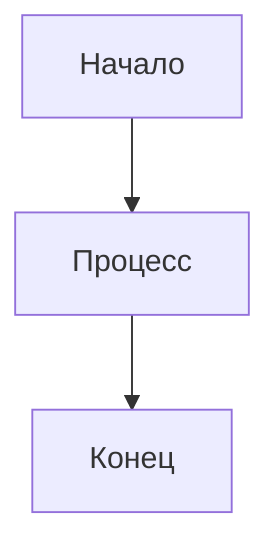

# Документация Hedge Fund AI Trading System

Эта папка содержит всю документацию проекта, которая автоматически публикуется в GitBook.

## 📁 Структура файлов

```
docs/
├── README.md              # Главная страница GitBook
├── SUMMARY.md             # Оглавление GitBook
├── book.json              # Конфигурация GitBook
├── README_DOCS.md         # Этот файл
├── GITBOOK_SETUP.md       # Инструкция по настройке GitBook
├── QUICKSTART.md          # Быстрый старт
├── ARCHITECTURE.md        # Архитектура системы
├── AGENTS.md              # AI агенты
├── DATABASE_SCHEMA.md     # Схема базы данных
├── API_TYPES.md           # Типы данных API
├── SIGNAL_PROCESSING.md   # Обработка сигналов
├── TECHNICAL_INDICATORS.md # Технические индикаторы
├── NEWS_API.md            # API новостей
├── TELEGRAM_BOT.md        # Telegram бот
├── DEPLOYMENT.md          # Развертывание
└── styles/                # Кастомные стили (опционально)
    ├── website.css
    └── website.js
```

## 🚀 Быстрый старт

### Локальная разработка

1. Установите GitBook CLI:
   ```bash
   npm install -g gitbook-cli
   ```

2. Перейдите в папку docs:
   ```bash
   cd docs
   ```

3. Установите зависимости:
   ```bash
   gitbook install
   ```

4. Запустите локальный сервер:
   ```bash
   gitbook serve
   ```

5. Откройте http://localhost:4000

### Сборка для продакшена

```bash
cd docs
gitbook build
```

## 📝 Правила написания документации

### Структура страницы

```markdown
# Заголовок страницы

## Краткое описание

Описание того, что содержится на этой странице.

## Основной контент

### Подраздел

Содержимое подраздела.

### Примеры кода

```typescript
// Пример TypeScript кода
interface Example {
  name: string;
  value: number;
}
```

### Диаграммы



## Ссылки

- [Связанная страница](./related-page.md)
- [Внешняя ссылка](https://example.com)
```

### Эмодзи

Используйте эмодзи для улучшения читаемости:
- 🚀 Быстрый старт
- 📚 Документация
- 🔧 Настройка
- 🐛 Исправления
- ✨ Новые функции
- ⚠️ Важные замечания

### Код

- Используйте подсветку синтаксиса
- Добавляйте комментарии к коду
- Показывайте примеры использования

### Диаграммы

- Используйте Mermaid для диаграмм
- Делайте диаграммы простыми и понятными
- Добавляйте описания к диаграммам

## 🔄 Автоматическое обновление

### GitHub Actions

При каждом push в ветку `main` с изменениями в папке `docs/`:

1. Автоматически собирается документация
2. Деплоится в GitBook
3. Обновляется live версия

### Pull Requests

При создании Pull Request с изменениями в документации:

1. Создается preview версия
2. Добавляется комментарий с ссылкой
3. Можно проверить изменения перед мержем

## 🎨 Кастомизация

### Стили

Создайте файл `docs/styles/website.css`:

```css
/* Кастомные стили */
.book-summary {
    background-color: #f8f9fa;
}

.book-body {
    font-family: 'Inter', sans-serif;
}
```

### JavaScript

Создайте файл `docs/styles/website.js`:

```javascript
// Кастомная логика
gitbook.events.on('page.change', function() {
    console.log('Page changed');
});
```

## 📊 Аналитика

### Google Analytics

Добавьте в `book.json`:

```json
{
  "pluginsConfig": {
    "ga": {
      "token": "UA-XXXXXXXXX-X"
    }
  }
}
```

### GitBook Analytics

Встроенная аналитика доступна в настройках пространства GitBook.

## 🔍 SEO

### Метаданные

Добавьте в начало каждой страницы:

```markdown
---
title: "Заголовок страницы"
description: "Описание страницы"
keywords: "ключевые, слова"
---
```

### Sitemap

GitBook автоматически генерирует sitemap.xml

## 🚀 Продвижение

### Социальные сети

Добавьте кнопки шаринга в `book.json`:

```json
{
  "plugins": [
    "sharing"
  ],
  "pluginsConfig": {
    "sharing": {
      "facebook": true,
      "twitter": true,
      "linkedin": true
    }
  }
}
```

### Комментарии

Добавьте систему комментариев:

```json
{
  "plugins": [
    "disqus"
  ],
  "pluginsConfig": {
    "disqus": {
      "shortName": "your-disqus-shortname"
    }
  }
}
```

## 🆘 Поддержка

### Полезные ссылки

- [GitBook Documentation](https://docs.gitbook.com/)
- [GitBook CLI](https://github.com/GitbookIO/gitbook-cli)
- [GitBook Plugins](https://plugins.gitbook.com/)
- [Mermaid Documentation](https://mermaid-js.github.io/mermaid/)

### Контакты

- **GitHub Issues**: [Создать issue](https://github.com/vlprosvirkin/hedge-fund/issues)
- **Email**: support@hedge-fund.com
- **Telegram**: @hedge_fund_support

## 📝 Чек-лист для новых страниц

- [ ] Добавлен заголовок и описание
- [ ] Использованы эмодзи для улучшения читаемости
- [ ] Добавлены примеры кода с подсветкой синтаксиса
- [ ] Созданы диаграммы Mermaid где необходимо
- [ ] Добавлены ссылки на связанные страницы
- [ ] Проверена корректность markdown разметки
- [ ] Добавлены метаданные для SEO
- [ ] Обновлен SUMMARY.md
- [ ] Протестирована локально с `gitbook serve`
